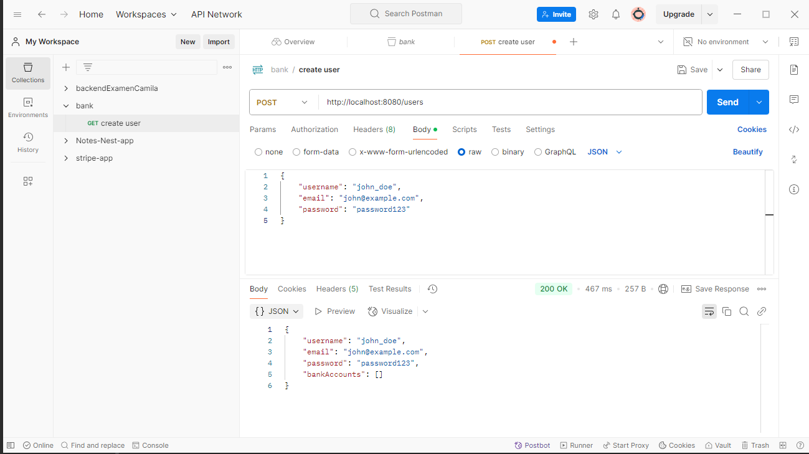
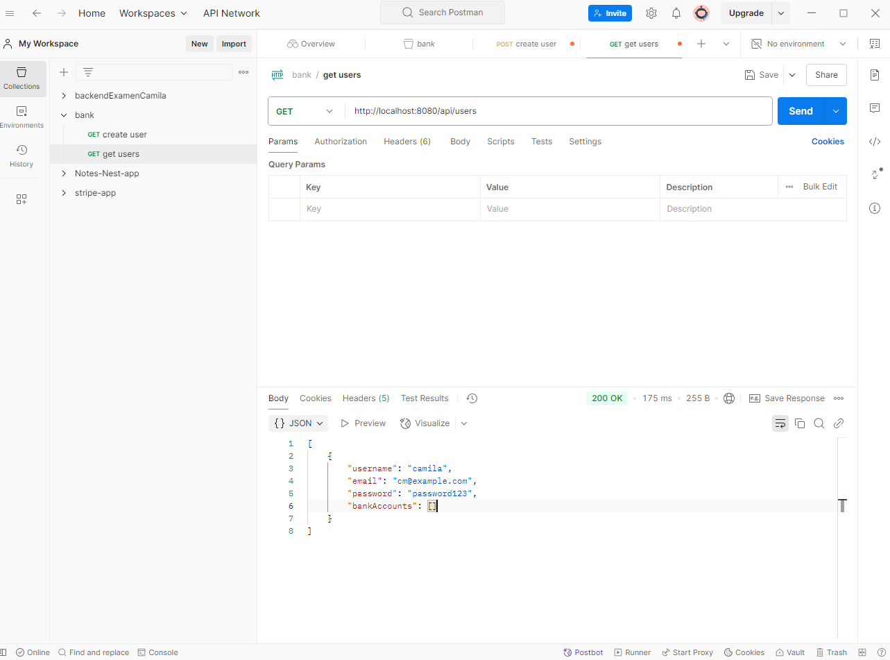
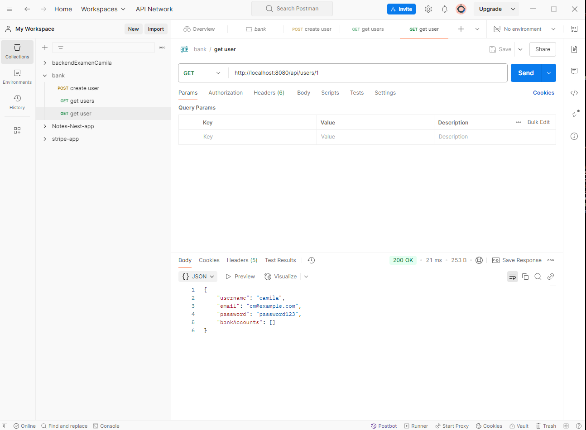
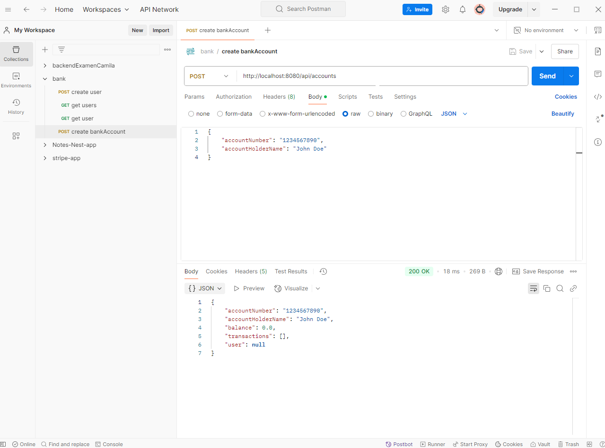
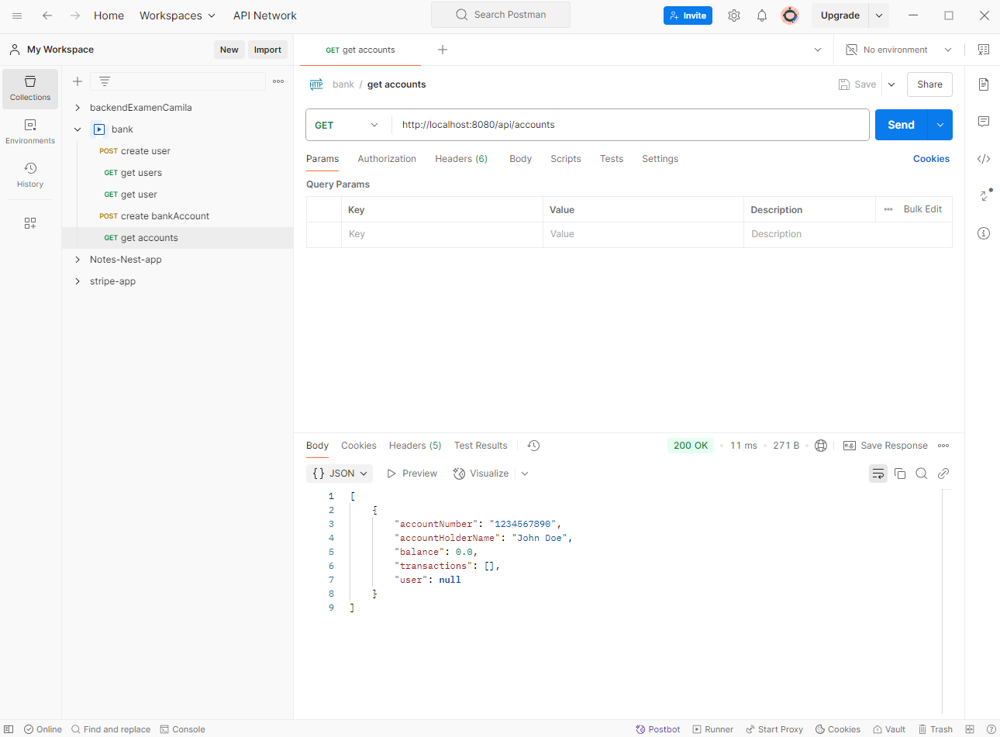
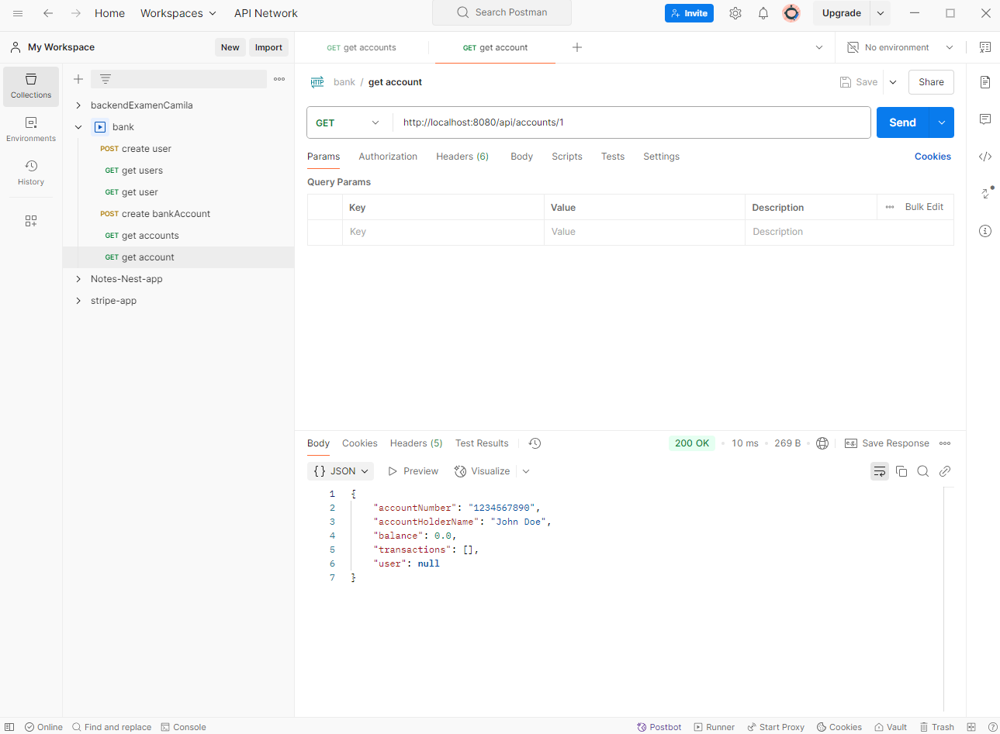
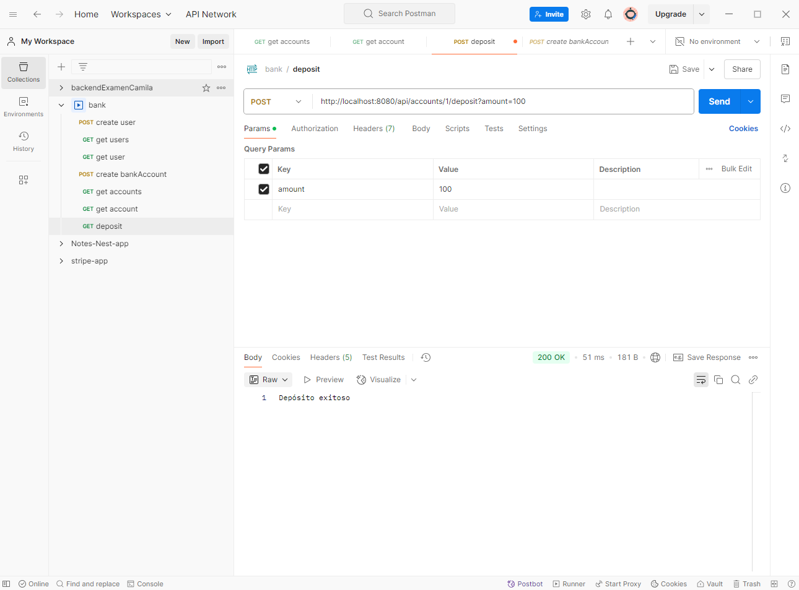
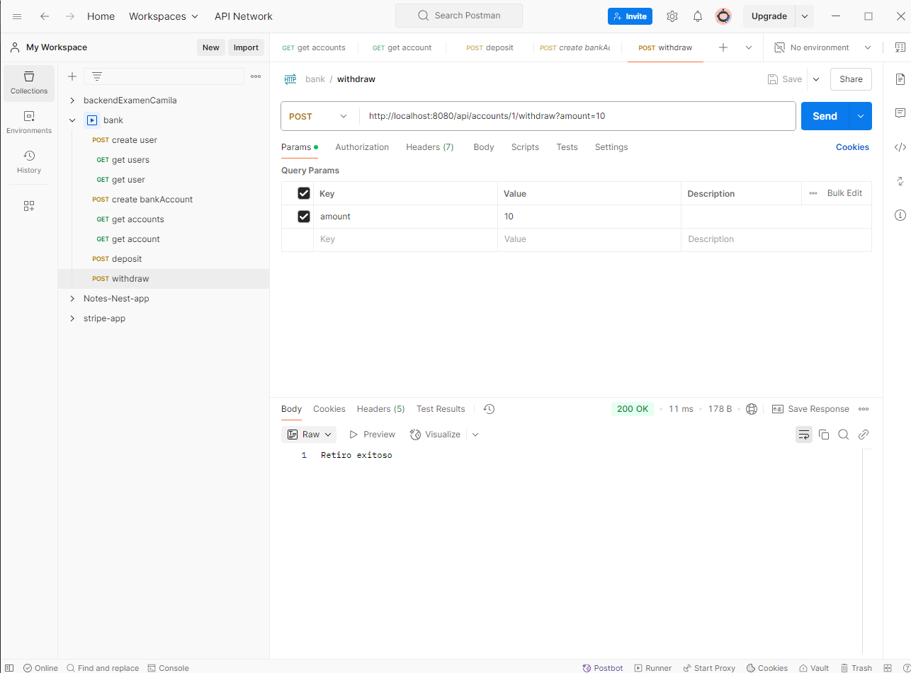
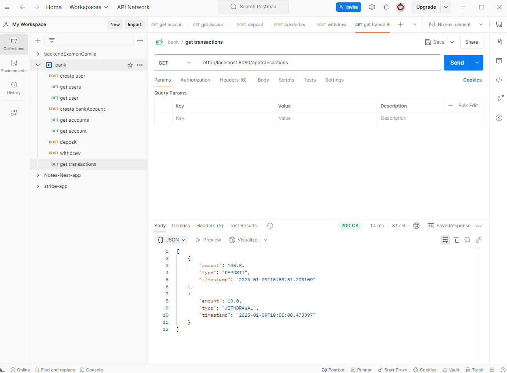
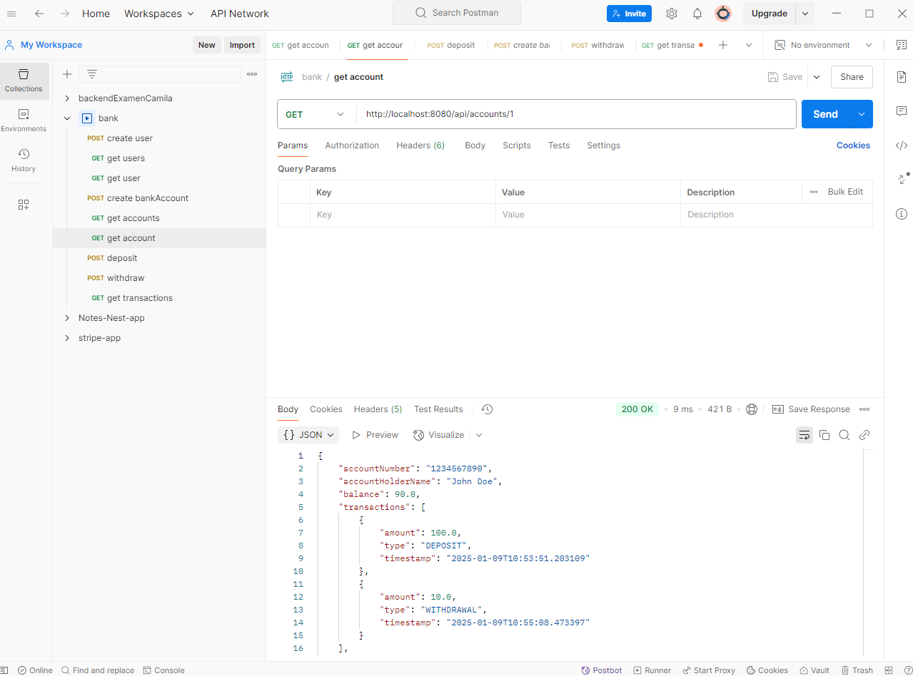

# Proyecto de Spring Boot

Instrucciones para correr el projecto:

Dirigirse a la carpeta raíz del projecto: ./csBankAccount y ejecutar el siguiente comando:

./gradlew bootRun

Proyecto en Gradle con Jar y Java 17
Dependencias: Spring Web, Spring Boot DevTools, Spring REST Docs, Spring Data JPA, h2database.

Primera parte:
Refactorización de la clase BankAccount para el proyecto en Spring Boot con el controlador web para las peticiones http.

## Crear usuario:

## Obtener usuarios:

## Obtener usuario:

## Crear cuenta:

## Obtener cuentas:

## Obtener cuenta:

## Depositar:

## Retirar:

## Obtener transacciones:

## Cuenta con transacciones:

